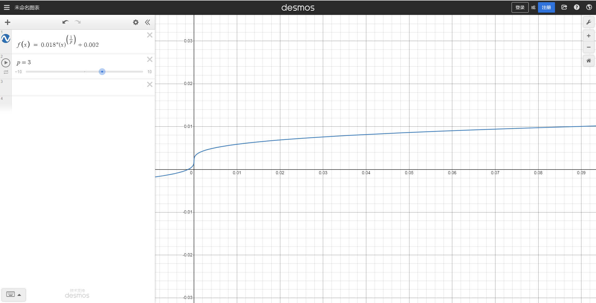

# 算法的目的和信息分类
我们需要根据所有已知的信息来向用户推荐合适的高考志愿。

考虑我们已经拥有了什么信息，这些信息可以简单地分为两类，一类是我们后台数据库中拥有的数据，和志愿推荐相关的主要信息是每一个学校每一年在每一个省份的最低录取位次，事实上，某个学校的最低录取位次关系到考生是否为将该学校纳入考虑范围的关键，一类是考生输入的信息，关键的信息是所在的省份和高考位次，考生所在的省份自然是必须的，因为每个学校在不同省份的招生政策不尽相同，因为必须确认考生的省份信息才能进行推荐，而高考位次就是直接决定推荐给考生的学校，也是不可或缺的信息。因此，我们的算法应当参照这两种信息来设计。

# 算法设计
## 初步考虑
该推荐算法实质上完成的工作就是对学校进行排序。如果实时根据考生的输入信息进行排序的话，虽然学校信息表中的行数大概就2600行，数量上可能比较小，但是排序的关键函数（key）是比较复杂的，而且每一行的数据大小比较大。学校信息表中存储了在每一个省份的各年份的最低录取位次，排序功能函数主要是筛选这个信息，测试表明完成一次排序至少需要5s以上，这样的体验无疑是糟糕的，所以我们必须从考虑有没有什么方法可能充分利用已知信息，从而尽可能缩短完成推荐的时间。
## 预处理设计
首先我们考虑每一个学校都在每个省份都有一个最低录取位次，事实上根据这个关键信息就可以给每一个学校在每个省份完成排序。考虑某个省份，每一个学校依据最低录取位次，排成一列，组成一个表格，这就完成了一个预处理过程，虽然此时我们已经可以通过查询这个表格，然后通过考生位次来区分大于该位次的学校和小于该位次的学校，来实现学校推荐，但是这没有考虑到学校位次的波动，而且由于不同层次学校的位次差距是一样的，对算法的稳定性也会有影响，例如招生位次靠前的学校的差距可能相差几百位，招生位次靠后可能相差几千位。虽然有了预处理设计，但是算法的效果可能不是很好。
## 最终算法
仍然做**预处理**操作，同时添加**归一化**操作，考虑某个省份$p$，假定该省份的考生总人数为$total\_num$，考虑一个二维可变长数组$mat$，初始化长度为$length$（本算法中为1000），记 $dis=floor(total\_ num \div length)$，我们将不同位次划分为一个个**位次区间** $[i*dis, (i+1)*dis)  (i=0,1,2 …… length-1)$。数组$mat$的每一个元素是一个数组，该数组中存储了$school\_id$（每一个学校的唯一区分标志），这样我们就可以建立位次区间到二维数组的双射了，也就是每一个位次区间都有一个$mat$中的元素和其对应。某个考生的位次假定为$rank$， 计算$index_1 = length*floor(rank \div total\_num)$，根据$index_1$就可以查询二维数组$mat[index_1]$，这样我们就完成了一个推荐的过程，查询得到的这一系列$school\_id$就是我需要根据该考生位次$rank$进行推荐的学校。

关键在于得到$mat$，假设先考虑省份$p$，某个学校去年的最低招生位次为$min\_section$，计算$index2 = length*floor(min\_section \div total\_num)$，就可以将学校的$school\_ id$加入到数组 $mat[index_2]$ 中，显然只将学校放入单个位次区间,这是不合理的，因为一旦考生的位次出现稍微的偏差就不会被推荐到该学校了。

此时，我们要对每个学校覆盖的位次区间进行**扩散化**，为什么叫做扩散化呢，因为我们已经得到了学校在$mat$中对应的索引$index_2$，考虑将其作为中心点，然后向两侧进行扩散，向左侧移动（减少）的位次占比$c_1$，向右侧扩散（减少）的位次占比$c_2$ （位次占比$c$乘以数组长度$length$就是$index_2$在$mat$移动的索引距离）。

$c_1$和$c_2$二者的大小应该是不一样，通常而言，$c_1$应当比$c_2$稍微大一点，$c_1$越大，该学校就越有可能被较高位次（比该学校最低位次高）的考生命中，$c_2$越大，该学校就越有可能被较低位次（比该学校最低位次低）的考生命中，有一个考生如果没有达到最低位次的话，一般来说是不会考虑该学校的，但是如果超出了最低位次的话就有可能考虑这个学校的。直接引入一个位次占比$c$，有$c_1 = c$, $c_2 = 0.8c$

现在需要怎么得到$c$，正如上一小节中讲到的，不同层次学校的位次差距是比较大的，而我们这里的位次区间划分上是等距划分，$c$较大的话，那么必然会导致招生位次靠前学校必然会覆盖大片范围，一个极端的例子就是，清华大学在大多数省份的招生都是集中在前0.1%（十万人的前100）,如果$c$较大，那么就会有可能变为前0.5%（十万人的前500），但是一般该位次学生是不会考虑清华大学的。同时$c$较小的话，对招生位次靠后的学校是有影响的。所以依照上述推导，$c$在学校招生位次靠前的时候应该比较小，在学校招生位次靠后的时候应该比较大。

首先计算$x = min\_section \div total\_num$，可知这里$0<x<1$，考虑并且在区间$[0,1]$上单调递增的凸函数$f\left(x\right)\ =\ a*(x)^{\left(\frac{1}{p}\right)}+b$，称其为**扩散函数**，让函数经过$(0,0.002)$和$(1,0.02)$，可以得到$a=0.018,b=0,002$。经过一系列的测试表明，当$p=3$时，函数图像比较合适，并且推荐效果较好，所以实际的算法也选择该函数。

# 算法的优势和改进可能
该算法在思路上具有一定创新性，同时推出也比较自然。首先如果对大量数据进行排序，这是比较耗时的，同时也是徒劳的，因为我们需要的是考生位次附近的学校的信息，过多的信息反而徒增计算的负担，然后自然的就有预处理的想法，只要将在某省份招生的学校按照最低招生位次进行排序就可以大大提升效率，然后不同省份每一年的考生的人数是不一样的，所以可以考虑到归一化，从而使关注点从实际位次转移到位次占比，不同省份就可以纳入到一个单独的讨论框架下了。最后在结合现实中高考志愿填报的情况，可以想出扩散化，紧接着也可以找出一个函数来描述不同情况扩散半径。

改进可能得考虑改造扩散函数，因为只要是在区间$[0,1]$上单调递增的函数就可以称为是扩散函数，也许其他的函数有着更好的效果，然后就是该推荐算法没有考虑到不同位次区间中考生的密度，事实上，考生的分布在位次区间这个概念下应该和$\chi^2(n)$卡方分布类似，可以认为其自由度$n$为高考科目数量。可以将卡方分布的区间$(0,\infty)$映射到$(0,1)$就可以得到对应的分布曲线，也可以只截取高概率部分。如果可以考虑到学生分布，应该可以进行更加准确地推荐。
